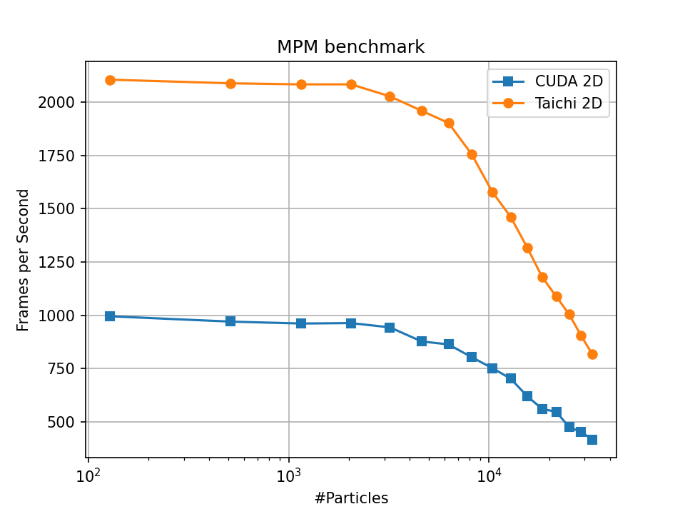
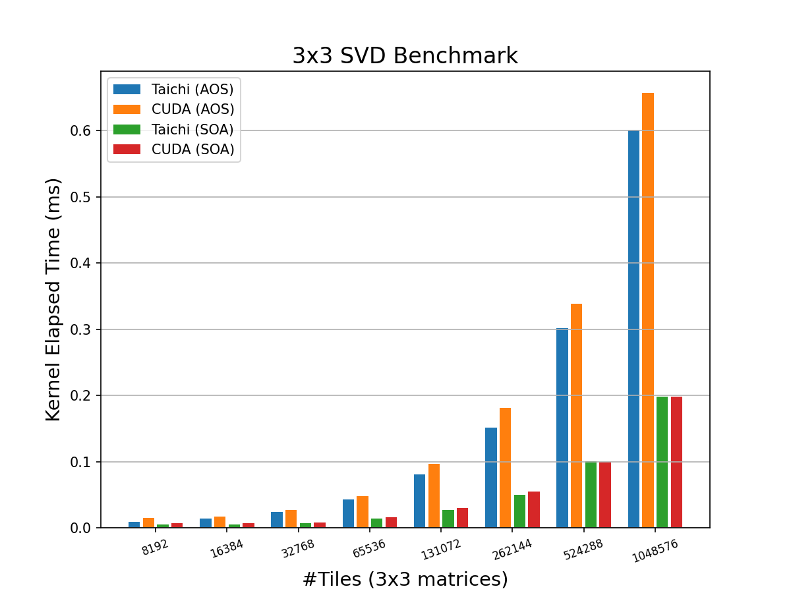
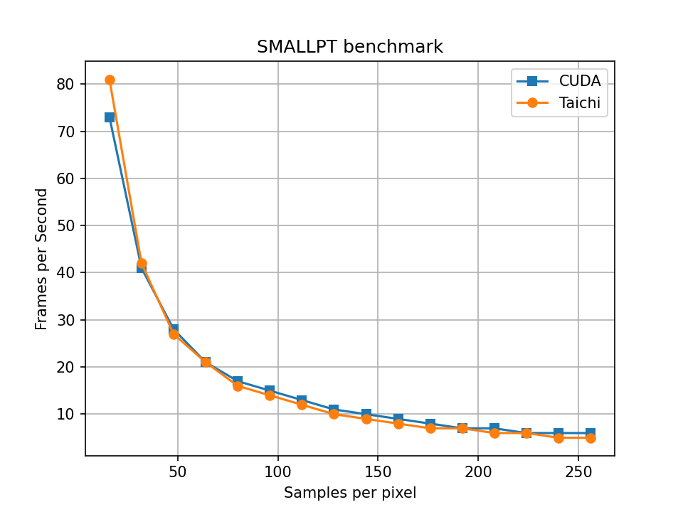
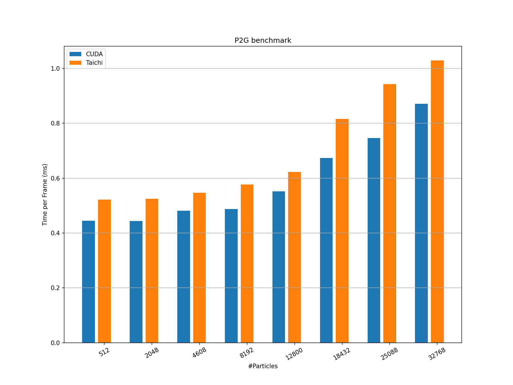
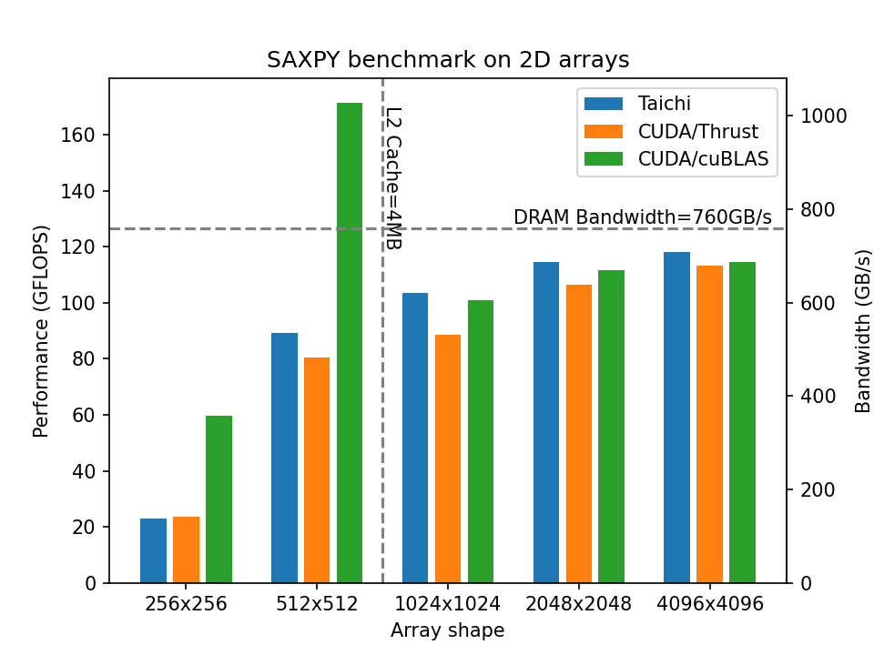
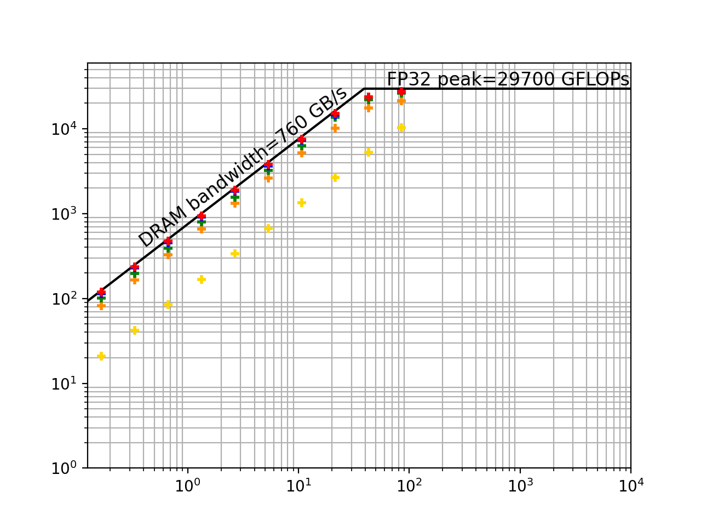
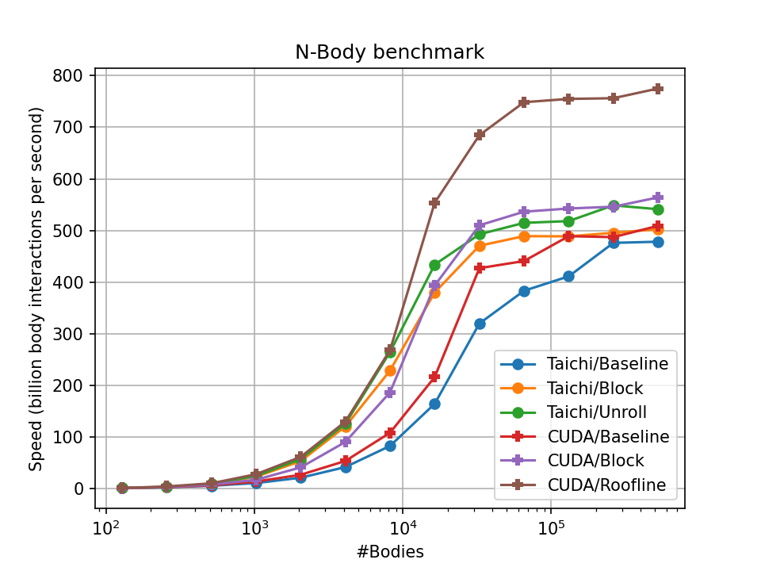

# Taichi Benchmarks

<!-- Purpose -->
The Taichi programming language is known for attaining high performance with easily understandable programs. The elegant parallel programming style has attracted many users to the Taichi community and we improve the compiler together. The benchmark codes here serve mainly three purposes:

* **Provide a target problem set**  
Since Taichi is a domain-specific language (DSL) focusing on the computer graphics and parallel computing domain, general benchmark cases cannot fully characterize Taichi to its benefit.
* **Provide a multidimensional comparison between Taichi and other popular frameworks**  
Performance is not the only objective, in fact, codes in this repository are not particularly tuned for the optimal performance. We also want to present the friendly, concise syntax Taichi exposed to its users. 
* **Open discussions for future performance improvements**  
Through comparing identical algorithms implemented in different frameworks, we can learn and benefit from the entire open-source community to keep improving our language and compiler.

In order to fulfill our purposes, we build this benchmark project with the following principles:
* **State-of-the-art baselines**  
Compare with well-performed baselines can help Taichi to get aware of further optimization opportunities.
* **Reproducible Results**  
Tests can be reproduced with the  `plot_benchmark.py` script under each subdirectory.
* **Easy-to-read Coding Style**  
Elegant coding styles and high performance are equally important. Thorough comparison between Taichi and manually optimized code can help to understand Taichi's optimization techniques.

<!-- Items -->
<!-- ## Benchmark Items -->

<!-- #### Bare-metal performance benchmarks -->
<!-- #### Algorithm building blocks -->
<!-- #### Applications -->

<!-- results -->
## Highlights
We have conducted performance evaluation on an Nvidia Geforce RTX3080 graphics card. Compared with the baselines, we highlight the inspiring performance achieved by Taichi on the basis of its easy-to-use programming style:
* Minimized coding efforts, doubled performance against CUDA and JAX in the [MPM](./mpm) and [differentiable smoke simulation](./diff-smoke) benchmarks.

* Comparable performance with CUDA, with easy-to-read code in the [3x3 SVD](./svd3) and [path tracer](./smallpt) benchmarks.

* Performance approaches device capability roofline, in terms of both computation and memory bandwidth in the [nested SAXPY](./saxpy) and [array fill](./fill) benchmarks.

  

# Gaps

We have also noticed significant performance gap against manually optimized CUDA code in the [N-body](./n-body) and [2D stencil](./stencil2d) benchmarks. 
We are working on the Taichi compiler to shrink the performance gaps. Welcome contribution!

<!-- Future works -->
<!-- Contribution Guidelines -->
## Future Works
We are pushing the benchmark work torwards two directions:

* **More benchmark items with strong baseline implementations**  
We are working on extending our benchmarks to cover more generalized parallel tasks. Benchmark items can be added when there are proper baseline implementations to compare with.

* **More devices**  
The current tests are conducted primarily on Nvidia GPUs. We are extending our benchmark on more diverse devices as Taichi is hardware neural. Also, performance reports are welcome if you have a device supported by Taichi!
