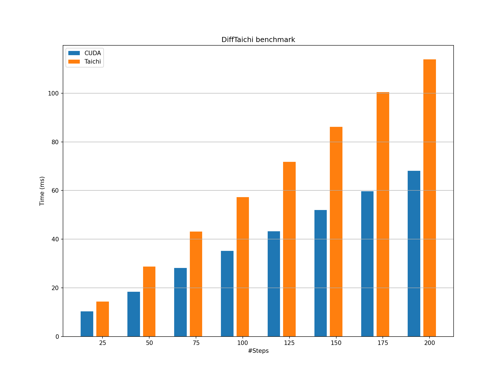
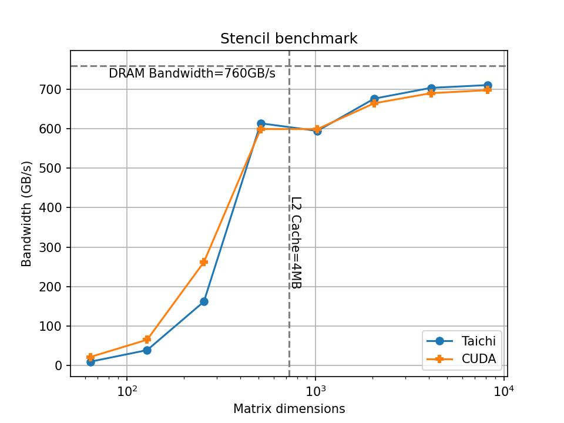

# Taichi Benchmarks

<!-- Purpose -->
The Taichi programming language is known for attaining high performance with easily understandable programs. The elegant parallel programming style has attracted many users to the Taichi community and we improve the compiler together. The benchmark codes here serve mainly three purposes:

* Provide a target problem set for Taichi: Since Taichi is a domain-specific language (DSL) focusing on the computer graphics and parallel computing domain, general benchmark cases cannot fully characterize Taichi to its benefit.
* Provide a multidimensional comparison between Taichi and other popular frameworks: Performance is not the only objective, in fact, codes in this repository are not particularly tuned for the optimal performance. We also want to present the friendly, concise syntax Taichi exposed to its users. 
* Open discussions for future performance improvement: Through comparing identical algorithms implemented in different frameworks, we can learn and benefit from the entire open-source community to keep improving our language and compiler.

<!-- We also apply with the [roofline model](https://en.wikipedia.org/wiki/Roofline_model) when possible. -->

<!-- Items -->
## Benchmark Items

## Highlights
Compared with baselines, we hightlight inspiring performance achieved by Taichi on the basis of its easy-to-use programming style:
* Minimized coding efforts, doubled performance against CUDA in the [MPM benchmark](./mpm).

* Comparable coding efforts, doubled performance against JAX in the [differentiable smoke simulation benchmark](./diff-taichi).

* State-of-the-art performance, flexible coding style against CUDA in the [3x3 SVD benchmark](./svd3).

* Performance approaches device capability roofline, in terms of both computation and memory bandwidth in the [Nested SAXPY Benchmark](./saxpy).

# Gaps

We have also noticed significant performance gap against manually optimized CUDA code in the [N-body benchmark](./n-body). 

We have also witnessed wired performance while comparing different backends in the [2D stencil benchmark](./stencil2d).

<em>Taichi Performance gap with different backends. Left: Vulkan. Right: CUDA.</em>

We are now working on the compiler to shrink the gap. Welcome contribution to the Taichi compiler!

## Contribution Guideline
