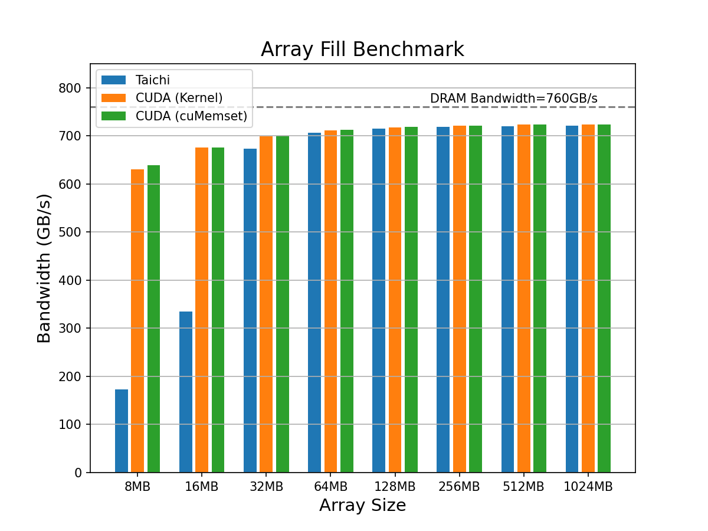

# Array Fill Benchmark

## Introduction

In this benchmark, we evaluate performance of filling an array with a single value on CUDA GPU. The built-in `fill` method in Taichi is implemented with `cuMemset`. We construct CUDA baseline in two approaches: 1) hand-written CUDA kernels and 2) invoke `cuMemset`.


## Evaluation
We conduct performance evaluation on the following device.

|Device| Nvidia RTX 3080 (10GB)|
|-----|-----------------------|
|FP32 performance| 29700 GFLOPS|
|Memory bandwidth| 760 GB/s|
|L2 cache capacity| 5MB|

Performance is measured with the achieved memory bandwidth, higher is better. In each experiment, we first conduct a warm-up run, and time for 500 repeated invokes as the kernel run time is extremely short. The tested array size jumps from 8MB to properly test against the DRAM bandwidth.

<p align="center">

</p>

We can tell from the figure that, all methods appraoch the peak bandwidth of the GPU on large arrays. For smaller Arrays, Taichi is bothered by the Python-side host overhead to launch the kernel. 500 loops is insufficient to diminish the impact of host overhead for such lightweight kernels. 

However, this doesn't affect performance in real scenarios. The `fill` funciton is generally used along with other computation kernels. With this regard, the host overhead can be ignored when kernel functions are complex -- where performance really matters.

## Reproduction Steps

* Pre-requisites
```shell
python3 -m pip install --upgrade taichi
python3 -m pip install matplotlib
```
If you want to compare with CUDA, make sure you have `nvcc` properly installed.

* Run the benchmark and draw the plots
```shell
python3 plot_benchmark.py
```