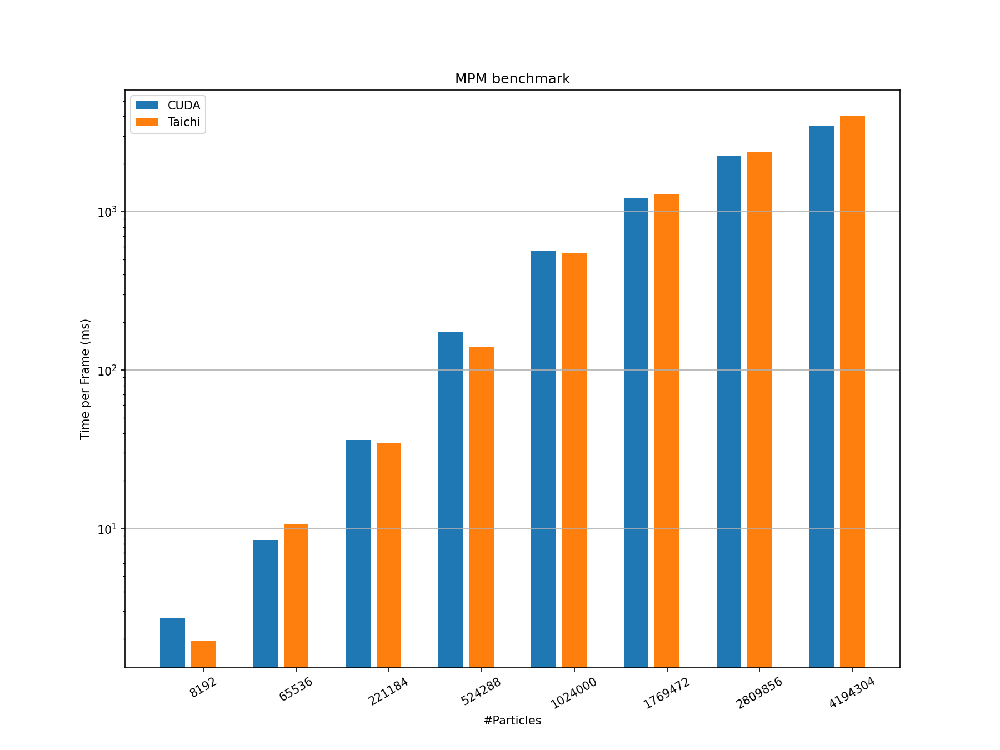

# Material Point Method (MPM) Benchmark

## Introduction
Material Point Method (MPM) is widely used in physical simulations. The required 
computations for high-quality scenarios are intensive, and the achievable performance
is critical for real-time applications.
In this benchmark, we compare a Taichi implementation to its ported version in CUDA.
The measurement is based on open-souce implementations. You can find the 
[Taichi implementation
here](https://github.com/taichi-dev/taichi/blob/master/python/taichi/examples/simulation/mpm3d.py)
and the [CUDA implementation here](https://github.com/Aisk1436/mpm3d).

For example, the <em>Particle to Grid</em> 
function is realized by an outermost for-loop within a Taichi kernel.
Instead of explicitly mapping the problem size to each GPU thread as in CUDA, 
Taichi automatically parallelizes the outermost for-loop. Consequently, the code
is more concise and easier to read.

## Evaluation
We conduct performance evaluation on the following device.

|Device| Nvidia RTX 3080 (10GB)|
|-----|-----------------------|
|FP32 performance| 29700 GFLOPS|
|Memory bandwidth| 760 GB/s|
|L2 cache capacity| 5MB|

Performance is measured in milliseconds per frame (ms), we run over different
number of particles, for 2- and 3-dimensions, respectively.

<p align="center">

</p>

<p align="center">

</p>

## Reproduction Steps

* Pre-requisites
```shell
python3 -m pip install --upgrade taichi
python3 -m pip install matplotlib
```
If you want to compare with CUDA, make sure you have `nvcc` properly installed.

* Run the benchmark and draw the plots
```shell
python3 plot_benchmark.py
```
