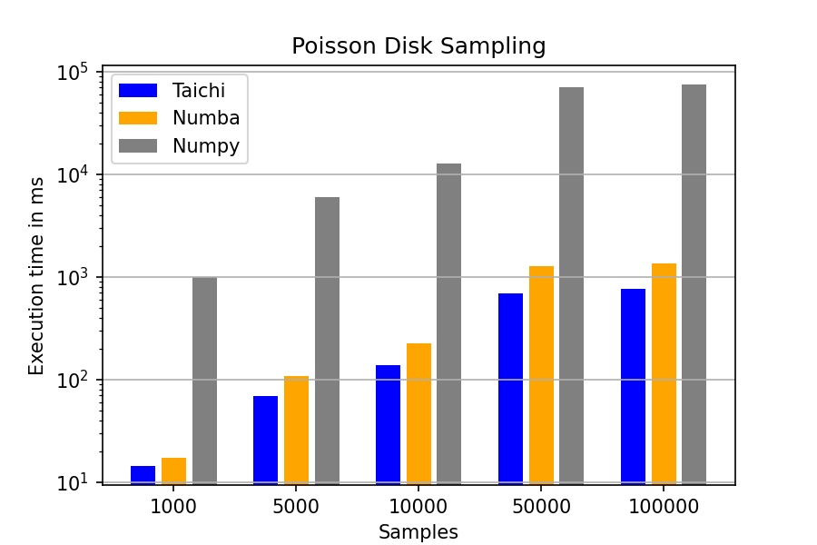

# Poisson Disk Sampling Benchmark

## Introduction
In this benchmark, we compare three Poisson Disk Sampling implementations among
Taichi, Numpy, and Numba.
The algorithm is suitable for single-threaded performance comparisons.
<p align="center">

</p>

## Evaluation
We conduct performance evaluation on the following device.

|Device| Nvidia RTX 3080 (10GB)|
|-----|-----------------------|
|FP32 performance| 29700 GFLOPS|
|Memory bandwidth| 760 GB/s|
|L2 cache capacity| 5 MB|
|Driver version| 470.57.02|
|CUDA version| 11.4|

Performance is measured in milliseconds (ms), we run over different
number of samples.
The reported times are measured using a 400 x 400 grid. 
The employed Taichi version 
is [1.0.0](https://github.com/taichi-dev/taichi/releases/tag/v1.0.0), 
the Numpy version is 1.21.5, the Numba version is 1.55.1, and the 
python version is 3.9.

<p align="center">

</p>

## Reproduction Steps

* Pre-requisites
```shell
python3 -m pip install numpy numba
python3 -m pip install taichi
python3 -m pip install matplotlib
```
* Run the benchmark and draw the plots
```shell
python3 plot_benchmark.py
```
