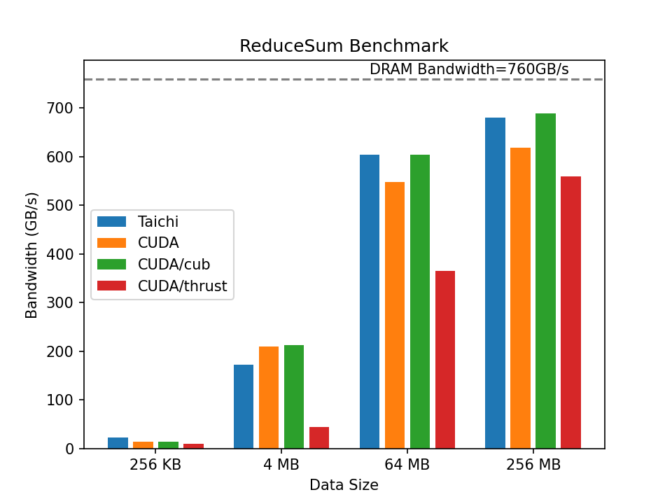
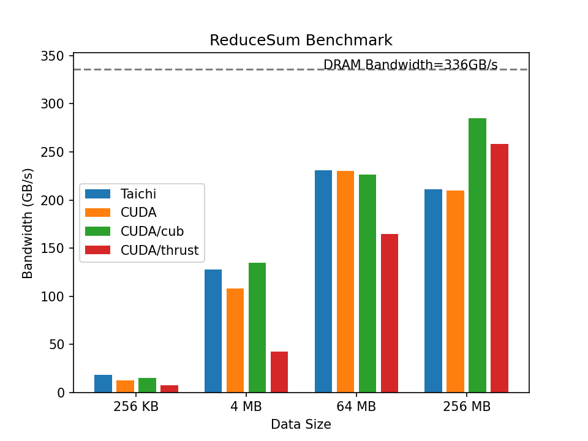

## Reduce Sum Benchmark

## Introduction

Reduce Sum is an essential operation in data analysis, deep learning, and physical simulations. Its output is the sum of n elements that are input. This benchmark compares a `Taichi` implementation with the 1.0 version in `CUDA`. The measurement is based on open-source and manual implementations. You can find the original [Taichi implementation](./src/taichi/reduce_sum.py) and the [CUDA implementation](./src/cuda).

In `CUDA` implementation, we offer manual, cub-based, and thrust-based versions. In the manual implementation, we completed this task with twice the kernel launched. The first launch is responsible for the internal elements of blocks. The reduction between Blocks is achieved in the next launch. However, there is only one kernel in the `Taichi` implementation. It automatically parallelizes the outermost for-loops. Consequently, the code is more concise and easier to read. 

## Evaluation

We conduct performance evaluations on the following device.

| Device            | Nvidia RTX 3080 (10GB) | Nvidia RTX 2060(6GB) |
| ----------------- | ---------------------- | -------------------- |
| FP32 performance  | 29700 GFLOPS           | 6451 GFLOPS          |
| Memory bandwidth  | 760 GB/s               | 336 GB/s             |
| L2 cache capacity | 5 MB                   | 3 MB                 |
| Driver version    | 470.57.02              | 510.47.03            |
| CUDA version      | 11.4                   | 11.6                 |

Performance is measured in bandwidth. The higher the bandwidth usage, the better. We run over different numbers($2^{16}\ 2^{20}\ 2^{24}\ 2^{26}$) with `float` data type. The results in the following figures are averaged over five times.

- Nvidia RTX 3080



- Nvidia RTX 2060



## Reproduction Steps

- Pre-requisites

```shell
python3 -m pip install --upgrade taichi
python3 -m pip install matplotlib
```

If you want to compare with `CUDA`, make sure you have `nvcc` properly installed.

- Run the benchmark and draw the plots

```shell
python3 plot_benchmark.py
```

