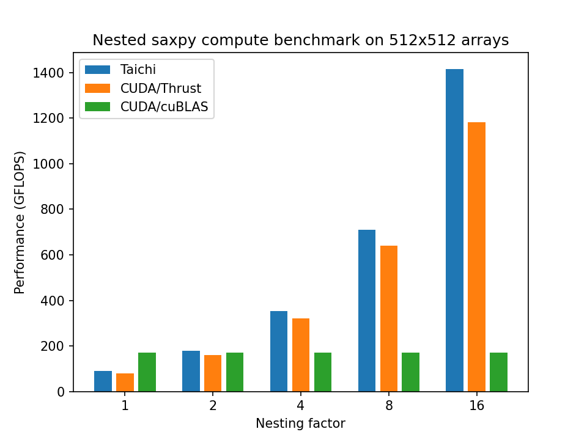
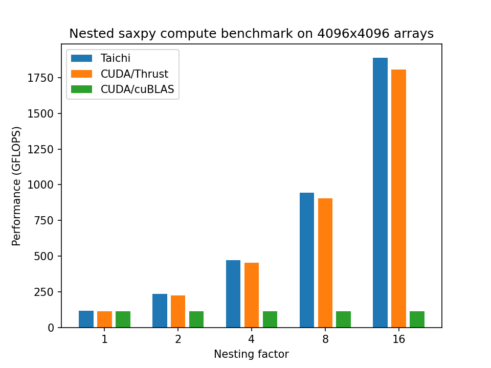

# SAXPY Benchmark

## Introduction

### SAXPY
SAXPY (Single-precision AX Plus Y) implements the formula of `Y = aX + Y`, where `X` and `Y` are vectors and `a` is a constant coefficient. 
It is a standard algorithm implemented in almost all BLAS libraries. 

The algorithm is generally recognized as a "memory-bound" problem which frequently traverses memory other than utlizing arithmetic units. 
To be more specific, 2 floating-point arithmetic operations and 3 memory operations (2 reads and 1 write) are conducted on each element. 
The overall compute load is `N * 2` and memory access footprint is `N * 3 * sizeof(float) = 12 * N`. The arithmetic intensity is `1/6` (floating-point operations per byte). 
We will use these formulas to assess compute and memory throughput in the subsequent sections.

### Nested SAXPY (Benchmark-only)

For benchmark purpose, it is meaningful to add more computation load to see how the program performs compared to a standard SAXPY.
We replay multiple SAXPY calculations for each element to distil arithmetic intensity.
That is to say, nesting multiple SAXPY calculations with the following fomula:

```
Y = a_m * (a_{m-1} * ( ... (a_1 * (a_0*X + Y) + Y) ... + Y) + Y
```

Given the nesting factor `m`, the computing load becomes `m * N * 2` while the memory footprint remains `12 * N`. 
The arithmetic intensity becomes `m / 6`. 
We can obtain a kernel function with desired arithmetic intensity by controlling the nesting factor.

## Implementation

The Taichi's SAXPY function has a concise implementation:
```python
coeff=[1.0, 2.0, 3.0, 4.0]
@ti.kernel
def saxpy_kernel(x: ti.template(), y: ti.template()):
    for i in ti.grouped(y):
        # Statically unroll
        z_c = x[i]
        for c in ti.static(coeff):
            z_c = c * z_c + y[i]
        y[i] = z_c
```
The values in `coeff` correponds to the constant coefficient `a` in the formulas. The length of `coeff` array corresponds to the nesting factor `m`. 
When `coeff` holds only one element, the implementation degrades to standard SAXPY.

We take two different CUDA-based approaches as baselines: Thrust and cuBLAS.  The details can be found in [Nvidia's official blog](https://developer.nvidia.com/blog/six-ways-saxpy/). For nested SAXPY, however, cuBLAS cannot efficiently leverage the increased arithmetic intensity as it is statically pre-compiled. Thrust is capable to nest by manually composing the formulas, a little troublesome though.

## Evaluation
### Device Specification

|Model| Nvidia RTX 3080 (10GB)|
|-----|-----------------------|
|FP32 performance| 29700 GFLOPS|
|Memory bandwidth| 760 GB/s|
|L2 cache capacity| 4MB|

### Standard SAXPY

We benchmark standard SAXPY on array shapes ranging from `256x256` to `4096x4096`. 

From the performance chart, we have witnessed great performance of cuBLAS on small matrices. The Taichi kernels suffer from the Python-side launch overhead as the computation time is quite short (less than 1ms). 
When array shapes grow larger than L2 cache capacity, Taichi, cuBLAS and Thrust all exhibits clost-to-peak performance. The utilization rate of memory bandwidth exceeds 90\%.

<p align="center">

</p>


### Nested SAXPY

By nesting multiple SAXPY routines, we drastically increase arithmetic load within the same memory footprint. Taichi significantly outperforms Thrust while keeping concise programming styles. The results for cuBLAS, however, has no improvements as we cannot feed more computation loads into its SAXPY kernel. It needs a specilized kernel to efficiently cover such scenarios.

<p align="center">
    
    
</p>

The enlightenment is, flexibility in coding styles can sometimes benefit compute performance, especially when computation is complex. For instance, an image processing pipeline might have multiple element-wise stages. With Taichi you can elegantly describe the computations and rapidly run the kernels on GPUs.

### Roofline

The nested SAXPY evaluation reveals great performance of Taichi in terms of utilizing the compute capability. How far can we push to the boundry of devices's compute capablility? In this section, we use the [Roofline Model](https://en.wikipedia.org/wiki/Roofline_model) to evaluate Taichi's performance on the `4096x4096` arrays. 

From RTX3080's specification table, we've known that the ridge point of arithmetic intensity that computation and memory bandwith all comes at peak is `29700 / 760 = 39.08`. As the nested SAXPY's arithmetic intensity is `m / 6.0`, the corresponding nesting factor is `234.47`. In other words, the nested SAXPY is memory-bandwith-bound when nesting factor `m` ranges from 1 to 256, and compute-bound for higher factors. 

<p align="center">

</p>

The plot demonstrates that Taichi achieves very close-to-peak performance in both memory-bound and compute-bound areas. 

## Reproduction steps
* Pre-requisites
```shell
python3 -m pip install --upgrade taichi
python3 -m pip install matplotlib
```
If you want to compare with CUDA, make sure you have `nvcc` properly installed.

* Run the benchmark and draw the plots
```shell
cd saxpy
# Reproduce benchmark comparison with CDUA
python3 plot_benchmark.py
# Reproduce taichi roofline benchmarks.
python3 plot_roofline.py
```
