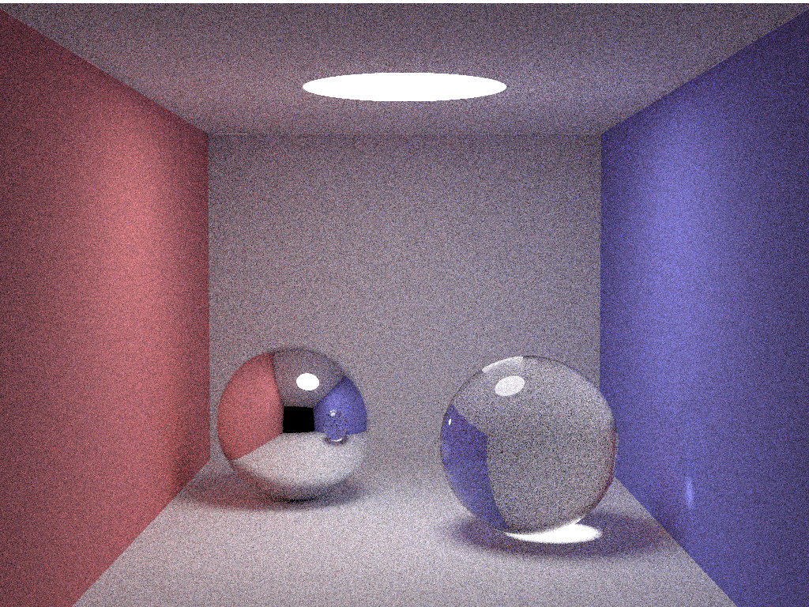

# Global Illumination Renderer (SmallPT) Benchmark

## Introduction
SmallPT is a global illumination renderer uses path tracing. Inspired by 
[Kevin Beason's smallpt: Global Illumination in 99 lines of
C++](https://www.kevinbeason.com/smallpt/).
In this benchmark, we compare the performance of Taichi with a CUDA implementation.
The measured CUDA implementation is based on an open-source implementation named
[smallptCuda](https://github.com/BentleyBlanks/smallptCuda).
The Taichi version is from one of our Taichi developers' implementation
[path tracing](https://github.com/erizmr/taichi_ray_tracing/blob/master/4_0_path_tracing.py).
The two implementations are functional equivalent.

<p align="center">

</p>


## Evaluation
We conduct performance evaluation on the following device.

|Device| Nvidia RTX 3080 (10GB)|
|-----|-----------------------|
|FP32 performance| 29700 GFLOPS|
|Memory bandwidth| 760 GB/s|
|L2 cache capacity| 5MB|

The experiments are executed with the following parameters: Image size 1024 by
768, sample on unit sphere surface, max depth (bounce) is 10.
The performance is measured in frames per second (fps), with different
samples per pixel configured.

<p align="center">

</p>

## Reproduction Steps

* Pre-requisites
```shell
python3 -m pip install --upgrade taichi
python3 -m pip install matplotlib
```
If you want to compare with CUDA, make sure you have `nvcc` properly installed.

* Run the benchmark and draw the plots
```shell
python3 plot_benchmark.py
```
