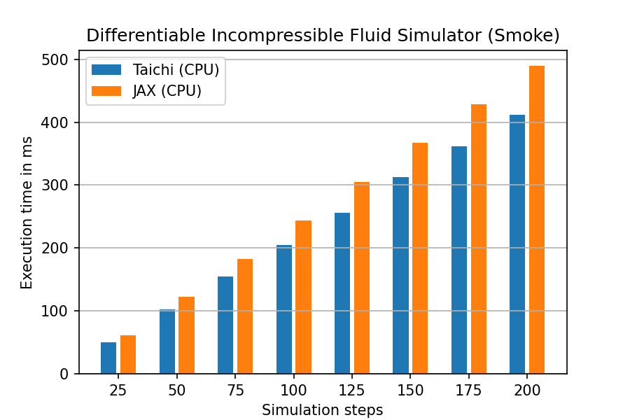

# Differentiable Incompressible Fluid Simulator (Smoke) Benchmark

## Introduction
In this benchmark, we compare two smoke simulator implementations between 
[JAX](https://github.com/google/jax) and 
[DiffTaichi](https://github.com/taichi-dev/difftaichi). 
The simulator is implemented with semi-Lagrangian advection and
and implicit pressure projection. Using gradient descent optimization 
on the initial velocity field, we are able to find a velocity field that
changes the pattern of the fluid to a target image.
There exists an earlier comparison in 
the DiffTaichi [ICLR 2020 paper](https://arxiv.org/pdf/1910.00935.pdf).
This benchmark updates the results with the latest version of JAX and Taichi.

<p align="center">
  
  
  
  
  
</p>


## Evaluation
We conduct performance evaluation on the following device.

|Device| Nvidia RTX 3080 (10GB)|
|-----|-----------------------|
|FP32 performance| 29700 GFLOPS|
|Memory bandwidth| 760 GB/s|
|L2 cache capacity| 5 MB|
|Driver version| 470.57.02|
|CUDA version| 11.4|

Performance is measured in milliseconds (ms), we run over different
number of simulation steps, for CPU and GPU implementations, respectively.

<p align="center">

</p>

<p align="center">

</p>

The reported times are measured using a 110 x 110 grid with each step 6 
Jacobi pressure projections. 
The employed Taichi version 
is [1.0.0](https://github.com/taichi-dev/taichi/releases/tag/v1.0.0), and
the JAX
package is 0.3.4 (jaxlib-0.3.2+cuda11.cudnn82) and python version 3.9.


## Reproduction Steps

* Pre-requisites
```shell
python3 -m pip install jax==0.3.4 jax[cuda11_cudnn82] -f https://storage.googleapis.com/jax-releases/jax_releases.html
python3 -m pip install taichi==1.0.0
python3 -m pip install matplotlib
```
If you want to compare with CUDA, make sure you have `nvcc` properly installed.

* Run the benchmark and draw the plots
```shell
python3 plot_benchmark.py
```
